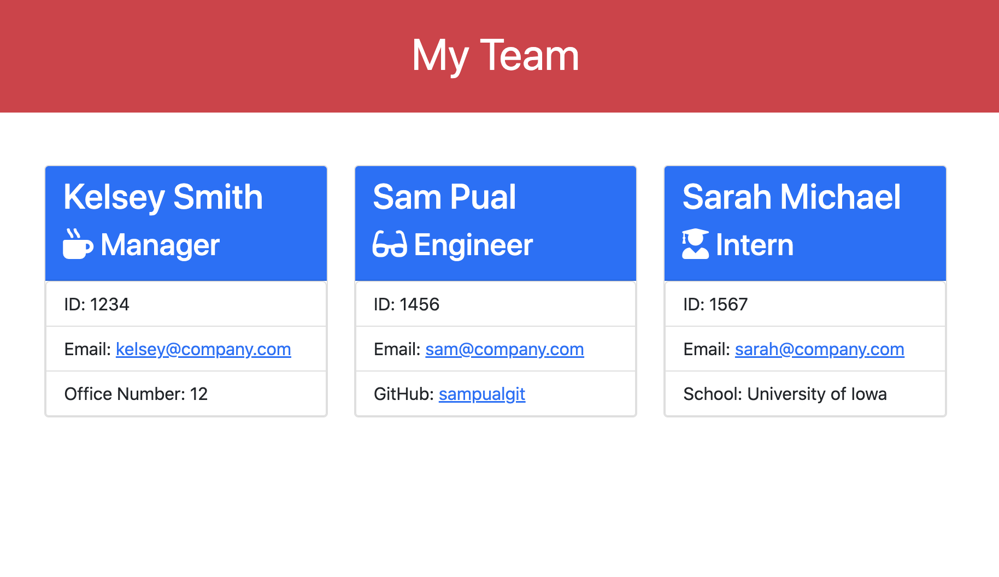

# Team Builder

## Description

A Node.js command-line application that takes in information about employees on a software engineering team and generates an HTML webpage that displays summaries for each person.

## Built With

- HTML
- CSS
- JavaScript
- Node.js
- Inquirer

## Installation

1. Clone the repo using `git clone`
2. Navigate to the app directory
3. Run `npm install` to install dependencies
4. Run `node index.js` in the command line to launch the application

## Usage

Link to video demonstration: [Team Builder Demo](https://drive.google.com/file/d/1B7-grkLsGBUrw_qJqdP2i4cAQ0dKEvUr/view)

## Contribution

Made with ❤️ by Kelsey Alderman
